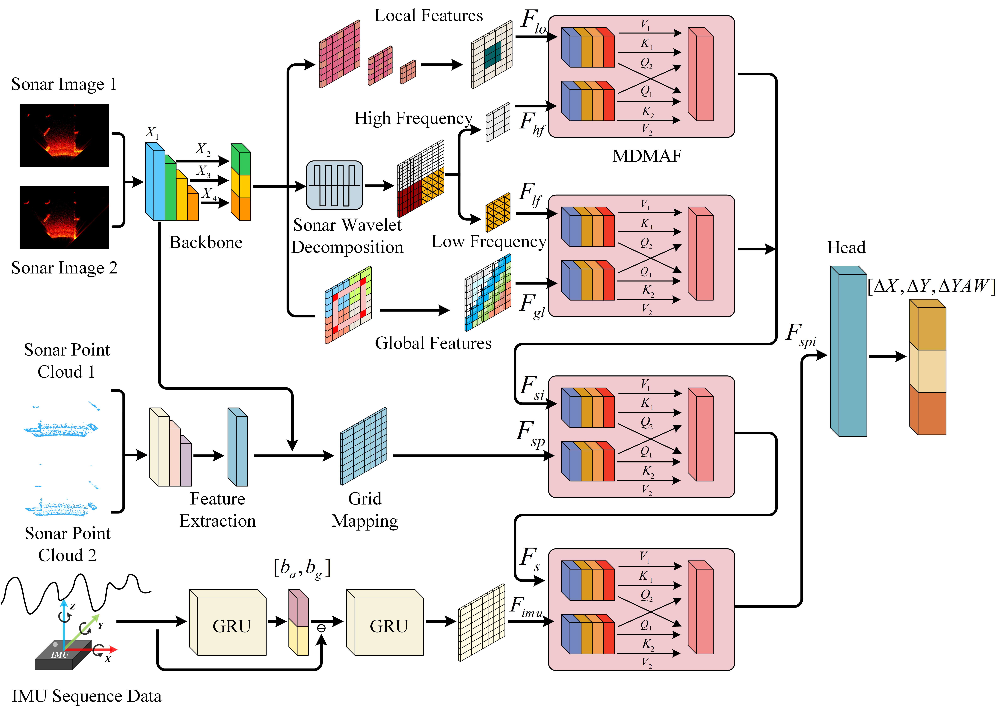

# DeepWavelet: A Multimodal Wavelet-Based Network for Sonar-Inertial Odometry in Underwater Robots



## Requirements
```
einops==0.8.1
matplotlib==3.7.5
numpy==1.24.1
open3d==0.19.0
opencv_python==4.11.0.86
pyproj==3.5.0
pytorch_wavelets==1.3.0
scipy==1.10.1
timm==1.0.15
torch==2.4.1+cu124
torchinfo==1.8.0
torchprofile==0.0.4
torchsummary==1.5.1
torchvision==0.19.1+cu124
tqdm==4.67.1
transformers==4.46.3
seaborn~=0.13.2
```

### Installation
To install the required packages, run the following command:

    pip install -r requirements.txt

## Datasets
We provide Fiuvia Nautic Dataset at `./Datasets/StPereDataset`

### Split Dataset
To split the dataset into training, validation, and testing sets, run the following command: 
`python ./Tools/split_datasets.py`

After running the command, the dataset will be split into `train`, `val`, and `test` folders in `./Split_Datasets/StPereDataset`

## Training
To train the DeepWavelet network, run the following command:
```
parser.add_argument('--log_path', type=str, default='./log', help='Logs save path')
parser.add_argument('--data_save_path', type=str, default='./Data', help='Data savepath')
parser.add_argument('--batch_size', type=int, default=2, help='batch size')
parser.add_argument('--lr', type=float, default=1e-4, help='learning rate')
parser.add_argument('--epochs', type=int, default=150, help='training epochs')
parser.add_argument('--warmup_ratio', type=float, default=0.1, help='warmup ratio')
parser.add_argument('--device', type=str, default='cuda', help='cuda or cpu')
parser.add_argument('--checkpoints_path', type=str, default='./Checkpoints', help='checkpoints save path')
parser.add_argument('--load_pretrained_model', type=bool, default=False, help='load pretrained model or not')
parser.add_argument('--resume_training', type=bool, default=True, help='resume training or not')
parser.add_argument('--dataset_name', type=str, default='StPereDataset', help='dataset name')
parser.add_argument('--dataset_path', type=str, default='./Datasets/StPereDataset', help='dataset path')
parser.add_argument('--dataset_split_path', type=str, default='./Split_Datasets/StPereDataset',
                        help='dataset split path')
parser.add_argument('--dataset_map_name', type=str, default='None',
                        help='if dataset name is StPereDataset, set map name None')
```

We provide a sample training script, run the following command:
`python ./train.py`

## Grad-CAM
After training the network, we can use Grad-CAM to visualize the important features of the network. 

You can find the weight file in `./Checkpointslatest_checkpoint_StPereDataset.pth`

To use Grad-CAM, run the following command:
`python ./grad_cam_display.py`

If running wrong, please chech `grad_cam_display.py` and modify the path of the weight file and the dataset path.

After running the command, you can get a plt figure as:


